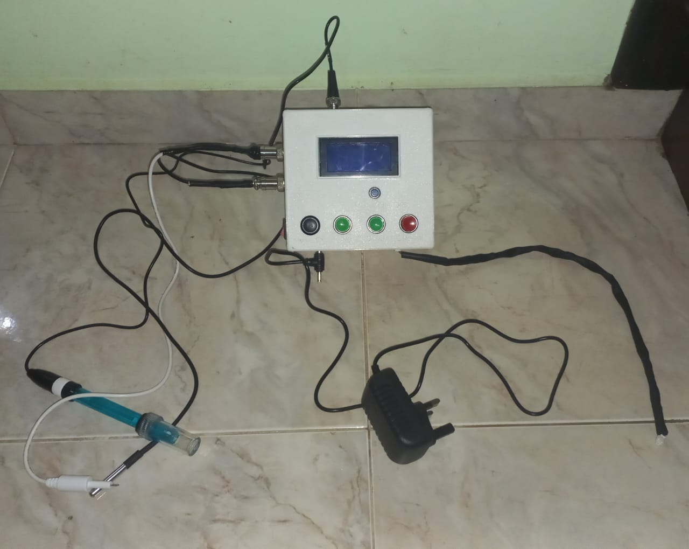

# Automated Aquaculture Tank Monitoring System

**Department of Electronic & Telecommunication Engineering, University of Moratuwa, Sri Lanka**  
**Authors:**  
H. M. G. N. I. Herath - 210216F  
H. M. V. Vidumini - 210669U  
**Module:** EN 2160 Electronic Design Realization  
**Submission Date:** 21st July 2024

## Overview

The Automated Aquaculture Tank Monitoring System is designed to provide real-time monitoring and management of crucial parameters in aquaculture environments. The system tracks pH levels, temperature, and total dissolved solids (TDS) in fish tanks and pools, ensuring optimal conditions for fish health and growth. Additionally, it features an integrated feeder system to automate the feeding process.

This project aims to contribute to the sustainability and efficiency of the aquaculture industry by offering a comprehensive solution that enhances productivity, improves operational efficiency, and safeguards fish health.

## Table of Contents

1. [General Specifications](#general-specifications)
2. [Project Objectives](#project-objectives)
3. [System Components](#system-components)
4. [Hardware Requirements](#hardware-requirements)
5. [Software Requirements](#software-requirements)
6. [Installation and Setup](#installation-and-setup)
7. [Usage](#usage)
8. [Contributing](#contributing)
9. [Acknowledgements](#acknowledgements)

## General Specifications

The project follows the Cambridge EDC model, which is structured into three main phases:

- **Explore:** Examination of existing products and stakeholder engagement to gather insights.
- **Create:** Development of conceptual designs based on identified needs.
- **Evaluate:** Assessment and refinement of designs to ensure they meet objectives and improve upon current market offerings.

## Project Objectives

- **Ensure Fish Health:** Continuous monitoring of pH, temperature, and TDS levels to maintain optimal conditions for fish well-being.
- **Improve Efficiency:** Automate monitoring and feeding processes to reduce labor and improve operational efficiency.
- **Enhance Productivity:** Provide actionable insights for optimizing farm management practices.

## System Components

The system comprises several key components:

- **Sensors:** For monitoring pH levels, temperature, and TDS.
- **Control Unit:** Manages data from sensors and controls the feeder.
- **Feeder System:** Automatically dispenses feed based on predefined schedules.
- **User Interface:** Displays real-time data and allows user interaction.

## Hardware Requirements

- Microcontroller (e.g., ATmega328P)
- pH sensor
- Temperature sensor
- TDS sensor
- LCD Display (with I2C module)
- DC Motor (for feeder system)
- Real-Time Clock (RTC) module (e.g., DS1302)
- Buzzer
- Additional connectors, resistors, capacitors, and other electronic components

## Software Requirements

- Arduino IDE for microcontroller programming
- Relevant libraries for sensor integration (e.g., LiquidCrystal_I2C for LCD, RTClib for RTC)
- Python or another language for data analysis (if needed)

## Installation and Setup

**Hardware Setup:**

- Assemble the hardware components according to the schematic diagrams provided in the project documentation.
- Connect the sensors to the microcontroller using appropriate connectors.

**Software Setup:**

- Download and install the Arduino IDE.
- Install necessary libraries (LiquidCrystal_I2C, RTClib, etc.).
- Upload the provided code to the microcontroller using the Arduino IDE.

## Usage

- Once the system is powered on, it will automatically begin monitoring the tank conditions.
- Real-time data will be displayed on the LCD screen.
- Alerts will be triggered if any parameter exceeds the predefined threshold.
- The feeder system can be scheduled to dispense feed automatically at set intervals.

## Contributing

Contributions are welcome! Please feel free to submit a pull request or open an issue to discuss any changes or improvements.

## Acknowledgements

We would like to acknowledge the support of the Department of Electronic & Telecommunication Engineering, University of Moratuwa, Sri Lanka.
